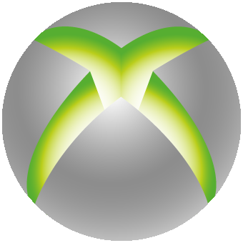
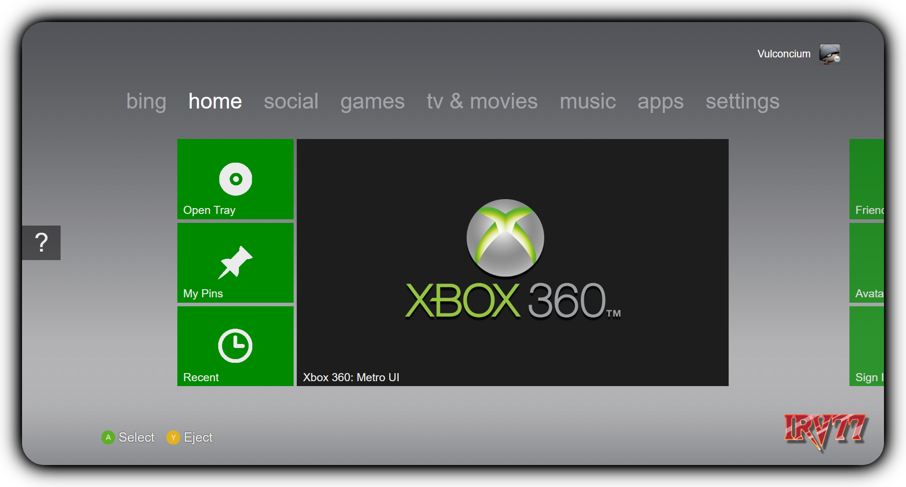

#  Xbox 360 Metro UI v1
 Recreation of the Xbox 360 Metro UI in HTML5! 
 Full recreation planned for the future

 

 ## Versions
 __v1.0.00__ - Main code with future updates planned!

 

## Features Planned

Click here to expand feature list

- [x] Main Home Screen
- [ ] All icons
- [ ] Interface sounds
- [ ] Startup screen
- [ ] Other menu screens

>__Finally [here](https://irv77.github.io/Xbox360UI/) is the live version of the code!__